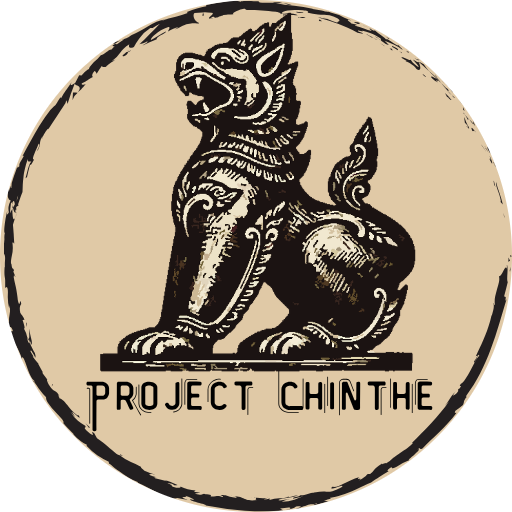

<p align="center">
  
</p>

# Project Chinthe — Censorship-Resistant Proxy Infrastructure

A production-grade VPN infrastructure built to bypass state-level internet censorship in Myanmar, optimized for low-latency gaming and designed for horizontal scaling.

> **Context**: Myanmar's military junta has deployed Chinese-sourced deep packet inspection systems (Tiangou Secure Gateway by Geedge Networks) capable of detecting and blocking standard VPN protocols like OpenVPN and WireGuard. This project uses advanced obfuscation protocols that make proxy traffic indistinguishable from legitimate HTTPS connections.

## Architecture

```
[Clients]                          [Infrastructure]                    [Internet]
                                   ┌──────────────────────────┐
  Mobile ──┐                       │  DigitalOcean (Singapore) │
  Desktop ─┤── HAPP / v2rayNG ────►│  Ubuntu 22.04 LTS         │──────► Open Internet
  IoT ─────┘                       │  ├── Hiddify Manager       │
                                   │  ├── Xray-core / Sing-box  │
  Telegram ────────────────────────│  ├── Telegram Bot (mgmt)   │
                                   │  └── AdGuard DNS upstream  │
                                   └──────────────────────────┘
                                          │
                                   ┌──────┴──────┐
                                   │ DuckDNS /    │
                                   │ Cloudflare   │──► DNS Failover
                                   └─────────────┘
```

## How Reality Protocol Defeats DPI

Standard VPNs are instantly detected by Myanmar's censorship infrastructure. VLESS-Reality takes a fundamentally different approach:

1. **Client** sends a TLS 1.3 ClientHello with encrypted authentication data in the Session ID field
2. **Server** decrypts the Session ID using a pre-shared key to identify legitimate clients
3. **Authenticated traffic** is proxied to the open internet
4. **Unauthenticated traffic** (censors probing the server) is forwarded to a real destination domain (e.g., `microsoft.com`)
5. **Result**: The server is indistinguishable from a legitimate web proxy — even under active probing

uTLS fingerprint mimicry ensures TLS handshakes are identical to Chrome browser connections, defeating fingerprint-based detection.

## Features

### Censorship Bypass
- **Primary Protocol**: VLESS-Reality — stealth protocol mimicking standard TLS traffic
- **Fallback Protocol**: VLESS-WSS (WebSocket + TLS) behind Cloudflare CDN
- **DNS Failover**: DuckDNS / Cloudflare dynamic DNS — if an IP is banned, update the DNS record to a new Droplet instantly

### Ad-Blocking & Privacy
- Network-wide ad blocking via DNS sinkholing (upstream DNS set to AdGuard: `94.140.14.14`)
- Blocks ads, trackers, and malicious domains automatically for all connected clients

### Gaming Optimization
- Full UDP support enabled for low ping and zero packet loss
- Optimized for mobile games (Mobile Legends, PUBG) in high-latency regions

### Geo-Routing / Split Tunneling
- Rule-based routing automatically handles local apps:
  - **Direct/Bypass**: Local banking apps (KBZPay, WavePay) route directly to prevent app freezing
  - **Proxied**: Blocked content (Facebook, YouTube, Netflix) routes through the VPN

### Automated User Management
- **Telegram Bot**: Fully automated — create trial accounts, extend subscriptions, check usage
- **User Portal**: Web-based dashboard for users to monitor their own bandwidth and subscription expiry
- **Subscription Provisioning**: Clients auto-update configs via subscription URLs or QR codes

### Stability
- **2GB Swap File** on 1GB RAM instances to prevent OOM crashes during high-load traffic (4K streaming)
- **BBR Congestion Control** for improved throughput over lossy Myanmar networks

## The Island Strategy (Scaling)

Instead of complex master-node clusters, the infrastructure uses **horizontal scaling with user sharding**:

| Server | Users | Status | Cost |
|--------|-------|--------|------|
| **Island 1** (Singapore) | Users 1–30 | Active | $6/mo |
| **Island 2** (Singapore) | Users 31–60 | Spin up at 70% CPU | $6/mo |
| **Island 3** (Bangalore) | Redundancy | Future | $6/mo |

**Why this works**:
- Each server is an independent failure domain — if Island 1's IP gets banned, Island 2 users are unaffected
- Linear cost scaling: $6 per 30 users
- No single point of failure
- New islands spin up in under 10 minutes using the automated SOP

## Tech Stack

| Component | Technology |
|-----------|-----------|
| **Proxy Engine** | Xray-core / Sing-box |
| **Management Panel** | Hiddify Manager |
| **Containerization** | Docker & Docker Compose |
| **Protocol (Primary)** | VLESS-Reality (TLS 1.3 mimicry) |
| **Protocol (Fallback)** | VLESS-WSS behind Cloudflare CDN |
| **Cloud Provider** | DigitalOcean (Singapore region) |
| **OS** | Ubuntu 22.04 LTS |
| **DNS** | DuckDNS / Cloudflare |
| **Ad Blocking** | AdGuard DNS (94.140.14.14) |
| **Client Apps** | HAPP, v2rayNG, Hiddify client |
| **Automation** | Bash scripts, Telegram Bot API |
| **Congestion Control** | BBR |

## Deployment SOP

1. **Provision**: Spin up DigitalOcean Droplet (Ubuntu 22.04, Singapore, $6/mo Basic)
2. **Install**: Run Hiddify all-in-one install script
3. **Optimize**: Execute swap script (2GB) to stabilize 1GB RAM instance
4. **Configure**: Set upstream DNS to AdGuard; enable UDP; connect Telegram Bot
5. **Protocol Setup**: Configure VLESS-Reality inbound with uTLS fingerprint and destination domain
6. **User Accounts**: Create accounts with traffic limits and expiration dates
7. **DNS Mapping**: Update DuckDNS/Cloudflare record to point to new server IP
8. **Client Distribution**: Generate subscription URLs or QR codes for users

## Security Considerations

- All authentication uses pre-shared keys — no passwords transmitted in the clear
- Server responds identically to the real destination domain for unauthenticated probes
- No identifiable VPN signatures in network traffic
- Per-user traffic limits and concurrent IP restrictions prevent abuse
- Split tunneling ensures local banking apps never touch the proxy (avoids triggering fraud detection)

## Future Roadmap

- [ ] Migrate to paid domain (`.xyz`) for Cloudflare "Orange Cloud" CDN protection
- [ ] Automated backups to external storage
- [ ] Expand to Island 2 (Bangalore region) for geographic redundancy
- [ ] Monitoring dashboard with uptime alerts

## Cost Analysis

| Component | Monthly Cost |
|-----------|-------------|
| DigitalOcean Droplet (1GB RAM) | $6 |
| DuckDNS | Free |
| Cloudflare DNS | Free |
| Hiddify Manager | Free (open-source) |
| **Total per 30 users** | **$6/month** |

## Disclaimer

This project was built for legitimate censorship circumvention to provide access to uncensored information. Internet freedom is a fundamental human right. Use responsibly and in accordance with applicable laws.

## Acknowledgments

- [Hiddify Manager](https://github.com/hiddify/Hiddify-Manager) — Open-source proxy management panel
- [Xray-core](https://github.com/XTLS/Xray-core) — VLESS-Reality protocol implementation
- [RPRX](https://github.com/RPRX) — Creator of the Reality protocol
